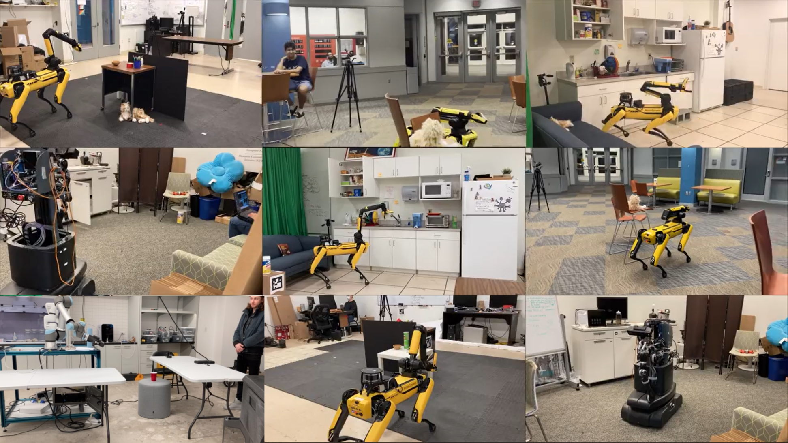

(click image to watch video)

# GenMOS (Generalized Multi-Object Search)

To get started, check out [this wiki page](https://github.com/zkytony/genmos_object_search/wiki/100-GenMOS:-A-System-for-Generalized-Multi-Object-Search).

This repo is structured as follows:
- [genmos_object_search](./genmos_object_search): a robot-independent package for object search that implements the GenMOS system.
- [ros](./ros): a ROS package that integrates `genmos_object_search` with ROS.
- [ros2](./ros2) a ROS 2 package that integrates `genmos_object_search` with ROS 2 (TODO)
- [viam](./viam): a Viam client application that integrates `genmos_object_search` with [Viam](https://www.viam.com/).

Check out the README in each directory for more information.

[Design.org](./Design.org) contains a documentation of the design of GenMOS as it was developed.

**Demo video:** https://www.youtube.com/watch?v=TfCe2ZVwypU

## Paper Reference
 I am still working on the camera-ready of the paper. For now, you can check out chapter 5 of my thesis for the latest writing about this project.

https://kaiyuzheng.me/documents/papers/dissertation.pdf (6.7MB)
